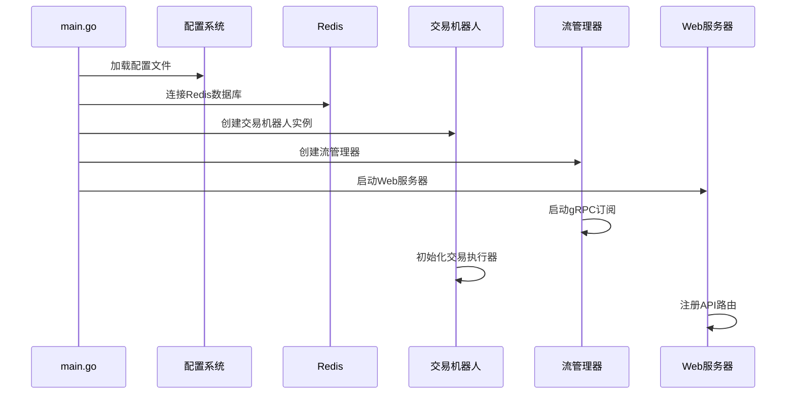
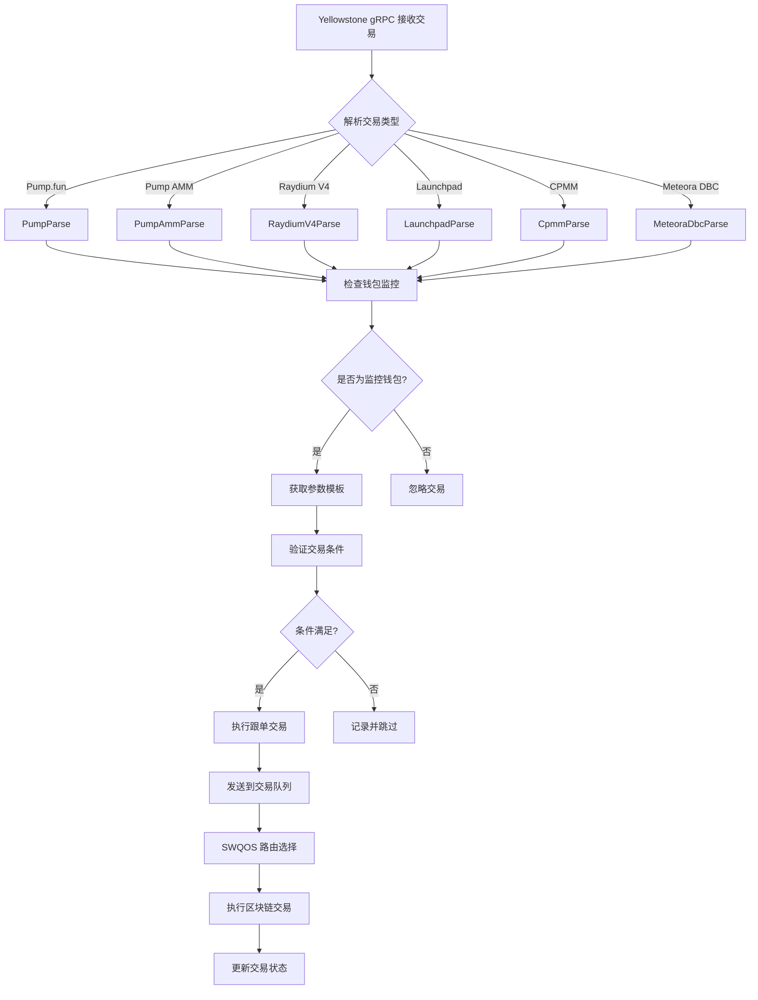
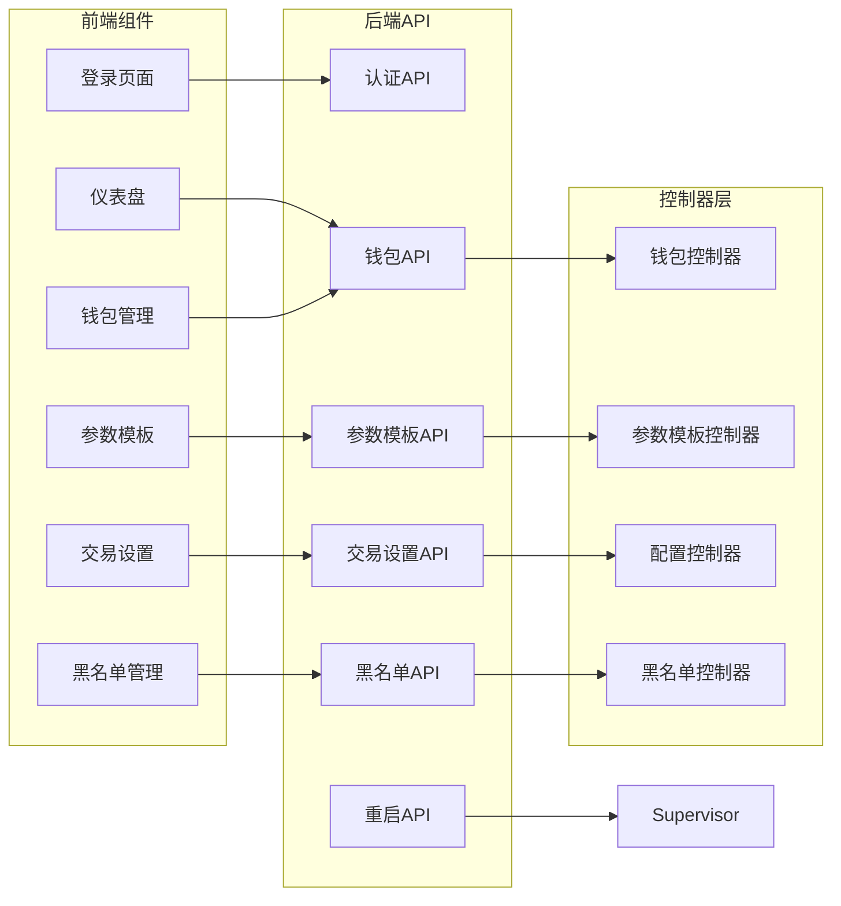
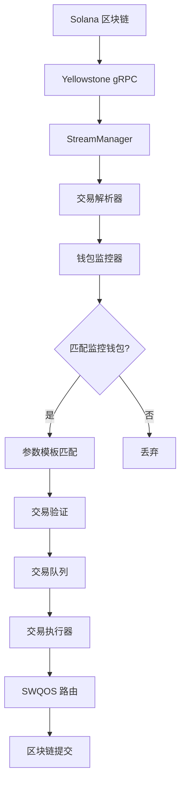
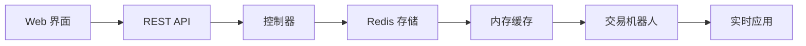
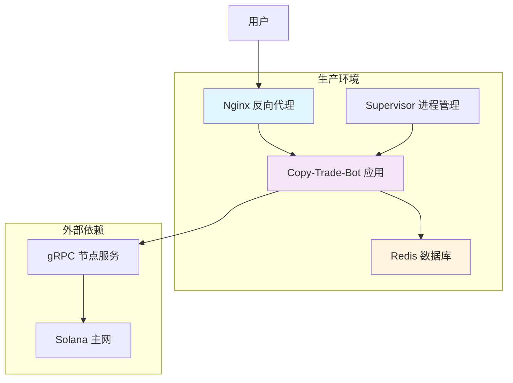
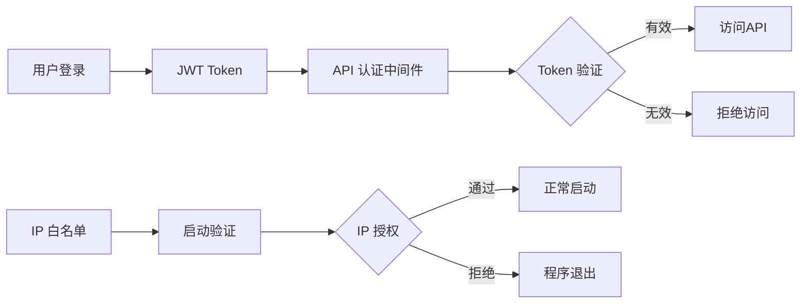

# Beyondjeet Sol跟单机器人系统架构图 - 专业级Sol跟单交易解决方案

[点击访问sol跟单机器人官网](https://beyondpump.app)

## 什么是Sol跟单机器人？

**Sol跟单机器人**是一款专为Solana生态设计的智能交易系统，通过实时监控聪明钱包的交易行为，自动执行**sol跟单交易**。我们的**sol跟单系统**采用Yellowstone gRPC技术，实现毫秒级响应，支持Pump.fun、Raydium等主流DEX平台，是目前市场上最先进的**sol自动跟单工具**。

### Sol跟单机器人核心优势

- 🚀 **毫秒级响应**: 采用Yellowstone gRPC实现超低延迟的**sol跟单交易**
- 🎯 **智能跟单**: 自动识别聪明钱包，精准执行**sol跟单策略**
- 🛡️ **风险控制**: 多重安全机制保障**sol跟单**资金安全
- 📊 **多平台支持**: 覆盖Solana生态主流交易平台
- 🔧 **灵活配置**: 可自定义**sol跟单参数**和交易策略

## Sol跟单系统整体架构

```mermaid
graph TB
    subgraph "外部服务"
        SOL[Solana 区块链]
        GRPC[Yellowstone gRPC]
        RPC[Solana RPC]
        REDIS[Redis 数据库]
        SUPER[Supervisor 进程管理]
    end

    subgraph "Web 管理界面"
        WEB[Web 服务器]
        HTML[前端界面]
        API[REST API]
        AUTH[认证系统]
    end

    subgraph "核心交易系统"
        MAIN[主程序 main.go]
        BOT[交易机器人 Bot]
        STREAM[流管理器 StreamManager]
        MONITOR[钱包监控器 WalletMonitor]
        QUEUE[交易队列 Queue]
    end

    subgraph "交易执行层"
        PUMP[Pump.fun 交易]
        PUMPAMM[Pump AMM 交易]
        RAYDIUM[Raydium V4 交易]
        LAUNCH[Launchpad 交易]
        CPMM[CPMM 交易]
        DBC[Meteora DBC 交易]
    end

    subgraph "支持服务"
        NONCE[Nonce 管理器]
        ASSET[资产管理器]
        SWQOS[SWQOS 服务质量]
        LOGGER[日志系统]
        CONFIG[配置管理]
    end

    subgraph "数据存储"
        WALLET[钱包数据]
        PARAM[参数模板]
        BLACK[黑名单]
        TRADE[交易记录]
    end

    %% 连接关系
    HTML --> API
    API --> AUTH
    API --> BOT
    API --> REDIS
  
    MAIN --> BOT
    MAIN --> STREAM
    MAIN --> MONITOR
    MAIN --> NONCE
    MAIN --> ASSET
  
    STREAM --> GRPC
    STREAM --> SOL
    MONITOR --> REDIS
  
    BOT --> PUMP
    BOT --> PUMPAMM
    BOT --> RAYDIUM
    BOT --> LAUNCH
    BOT --> CPMM
    BOT --> DBC
  
    BOT --> QUEUE
    BOT --> SWQOS
    BOT --> NONCE
  
    REDIS --> WALLET
    REDIS --> PARAM
    REDIS --> BLACK
    REDIS --> TRADE
  
    WEB --> SUPER
  
    style SOL fill:#f9f,stroke:#333,stroke-width:2px
    style REDIS fill:#ff9999,stroke:#333,stroke-width:2px
    style BOT fill:#99ff99,stroke:#333,stroke-width:2px
    style WEB fill:#9999ff,stroke:#333,stroke-width:2px
```

## Sol跟单机器人核心组件详细架构

### 1. Sol跟单系统启动流程

### 2. Sol跟单交易执行流程

### 3. Sol跟单机器人Web管理系统架构

## Sol跟单机器人数据流架构

### 1. Sol跟单交易实时数据流

### 2. Sol跟单机器人配置数据流

## Sol跟单机器人关键技术组件

### 1. Sol跟单系统核心模块

| 模块       | 文件路径              | 功能描述         |
| ---------- | --------------------- | ---------------- |
| 主程序     | `main.go`           | 系统启动和初始化 |
| 交易机器人 | `bot/`              | 核心交易逻辑     |
| 流管理器   | `stream/manager.go` | gRPC 数据流管理  |
| 钱包监控   | `wallet/monitor.go` | 钱包状态监控     |
| Web服务    | `web/server.go`     | HTTP API 服务    |

### 2. Sol跟单机器人支持的交易平台

| 平台        | 模块路径               | Sol跟单功能      |
| ----------- | ---------------------- | ---------------- |
| Pump.fun    | `pump/`              | Sol跟单买入、卖出、解析 |
| Pump AMM    | `pumpamm/`           | Sol跟单AMM交易   |
| Raydium V4  | `raydium/`           | Sol跟单V4协议交易 |
| Launchpad   | `raydium_launchpad/` | Sol跟单新币发行交易 |
| CPMM        | `raydium_cp_swap/`   | Sol跟单集中流动性 |
| Meteora DBC | `dbc/`, `dbcv2/`   | Sol跟单DBC协议交易 |

### 3. 支持服务

| 服务      | 模块路径            | 功能           |
| --------- | ------------------- | -------------- |
| Nonce管理 | `noncecache/`     | 交易nonce优化  |
| 资产管理  | `asset/`          | 余额和持仓管理 |
| SWQOS     | `swqos/`          | 服务质量和路由 |
| 配置管理  | `utils/config.go` | 配置加载和管理 |
| 日志系统  | `logger/`         | 结构化日志     |

## Sol跟单机器人部署架构

## Sol跟单机器人安全架构

### 1. Sol跟单系统认证与授权

### 2. Sol跟单机器人数据安全

- **私钥管理**: Sol跟单机器人采用本地存储，私钥不上传到服务器
- **API 认证**: Sol跟单系统使用JWT Token认证机制
- **网络安全**: Sol跟单交易全程HTTPS加密传输
- **访问控制**: Sol跟单机器人支持IP白名单限制

## Sol跟单机器人性能优化

### 1. Sol跟单交易并发处理

- **Goroutine 池**: Sol跟单机器人并发处理多笔交易
- **Channel 通信**: Sol跟单系统异步消息传递
- **连接池**: Sol跟单交易Redis连接复用

### 2. Sol跟单机器人缓存策略

- **内存缓存**: Sol跟单系统热点数据缓存
- **Redis 缓存**: Sol跟单交易持久化数据存储
- **参数模板缓存**: Sol跟单机器人减少数据库查询

### 3. Sol跟单交易网络优化

- **gRPC 流**: Sol跟单机器人实时数据订阅
- **连接复用**: Sol跟单系统HTTP Keep-Alive
- **负载均衡**: Sol跟单交易SWQOS智能路由

## 总结

这个**Sol跟单机器人**架构图展示了完整的**sol跟单系统**架构，包括核心组件、数据流、部署方式和安全机制。我们的**sol跟单交易系统**采用模块化设计，支持多个Solana生态交易平台，具备高性能和高可用性特征。

### 为什么选择我们的Sol跟单机器人？

1. **技术领先**: 采用Yellowstone gRPC技术，实现毫秒级**sol跟单交易**
2. **安全可靠**: 多重安全机制保障**sol跟单**资金安全
3. **功能完善**: 支持6大主流DEX平台的**sol跟单交易**
4. **易于使用**: 直观的Web界面管理**sol跟单参数**
5. **性能卓越**: 高并发处理能力，确保**sol跟单**不错过任何机会

立即体验我们的**Sol跟单机器人**，开启您的**sol自动跟单**之旅！

[点击访问sol跟单机器人官网](https://beyondpump.app)
